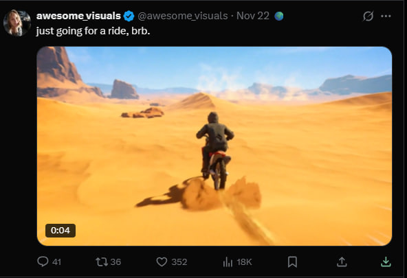

# Twitter Region Viewer 🌍

یک افزونه کروم که اطلاعات "Account based in" (محل حساب کاربری) و "Connected via" (متصل شده از طریق) کاربران توییتر/ایکس را مستقیماً روی پست‌های آن‌ها نمایش می‌دهد.

## قبل



## بعد


## 🚀 ویژگی‌ها

- **تشخیص منطقه**: کشوری که حساب کاربری در آن مستقر است را نمایش می‌دهد (مثلاً "United States 🇺🇸").
- **اطلاعات اتصال**: پلتفرمی که برای اتصال استفاده شده را نشان می‌دهد (مثلاً "Android 🤖", "iPhone 🍎", "Web 🌐").
- **وضعیت تایید**: اگر حساب دارای آیکون وضعیت تایید خاصی باشد (به جز آیکون‌های اطلاعات عمومی)، یک دایره سبز 🟢 نمایش می‌دهد.
- **جزئیات با هاور (Hover)**: با نگه داشتن موس روی اطلاعات منطقه، یک تولتیپ با جزئیات کامل نمایش داده می‌شود.
- **بروزرسانی داده‌ها**: دارای دکمه بروزرسانی (🔄) برای دریافت مجدد و آپدیت اطلاعات منطقه در صورت تغییر.
- **محافظت در برابر محدودیت نرخ (Rate Limit)**: از مکانیزم "کلیک برای بارگذاری" (🌍) استفاده می‌کند تا از مسدود شدن مرورگر شما توسط توییتر به دلیل درخواست‌های بیش از حد جلوگیری کند.
- **ذخیره‌سازی (Caching)**: داده‌های دریافت شده را به صورت محلی ذخیره می‌کند تا مجبور نباشید برای یک کاربر تکراری دوباره آن را بارگذاری کنید.

## 🛠️ نحوه کارکرد

1. **فعال‌سازی**: این افزونه روی `twitter.com` و `x.com` اجرا می‌شود.
2. **تزریق رابط کاربری**: یک آیکون کوچک کره زمین (🌍) را در کنار نام کاربران در فید شما قرار می‌دهد.
3. **دریافت داده‌ها**: وقتی روی آیکون کلیک می‌کنید، افزونه صفحه `/about` کاربر را در یک iframe مخفی و سندباکس شده بارگذاری می‌کند.
4. **دور زدن محدودیت‌ها**: از قوانین `declarativeNetRequest` برای حذف هدرهای `X-Frame-Options` و `Content-Security-Policy` استفاده می‌کند تا iframe بتواند با موفقیت بارگذاری شود.
5. **تجزيه و تحلیل (Parsing)**: DOM مربوط به iframe مخفی را برای استخراج داده‌های خاص منطقه و اتصال تجزیه و تحلیل می‌کند.
6. **نمایش**: داده‌های استخراج شده با ایموجی‌ها فرمت‌دهی شده و در کنار نام کاربر نمایش داده می‌شوند.

## 📦 نصب

1. این مخزن را کلون کنید:

    ```bash
    git clone https://github.com/masooddalman/Twitter-Region-Viewer.git
    ```

2. کروم را باز کنید و به آدرس `chrome://extensions/` بروید.
3. گزینه **Developer mode** را در گوشه بالا سمت راست فعال کنید.
4. روی **Load unpacked** کلیک کنید.
5. پوشه‌ای که مخزن را در آن کلون کرده‌اید انتخاب کنید.

## 🤝 مشارکت

**این یک پروژه عمومی است و از مشارکت‌ها استقبال می‌شود!**

اگر ایده‌ای برای بهبود، رفع باگ یا ویژگی‌های جدید دارید (مانند گسترش نقشه پرچم کشورها)، لطفاً یک Pull Request ارسال کنید.

1. مخزن را Fork کنید.
2. شاخه ویژگی خود را ایجاد کنید (`git checkout -b feature/AmazingFeature`).
3. تغییرات خود را کامیت کنید (`git commit -m 'Add some AmazingFeature'`).
4. به شاخه خود Push کنید (`git push origin feature/AmazingFeature`).
5. یک Pull Request باز کنید.

## ⚠️ سلب مسئولیت

این افزونه برای اهداف آموزشی و تحقیقاتی است. این افزونه به ساختار HTML فعلی X.com متکی است که ممکن است هر زمان تغییر کند. لطفاً مسئولانه از آن استفاده کنید تا از محدود شدن توسط پلتفرم جلوگیری کنید.
